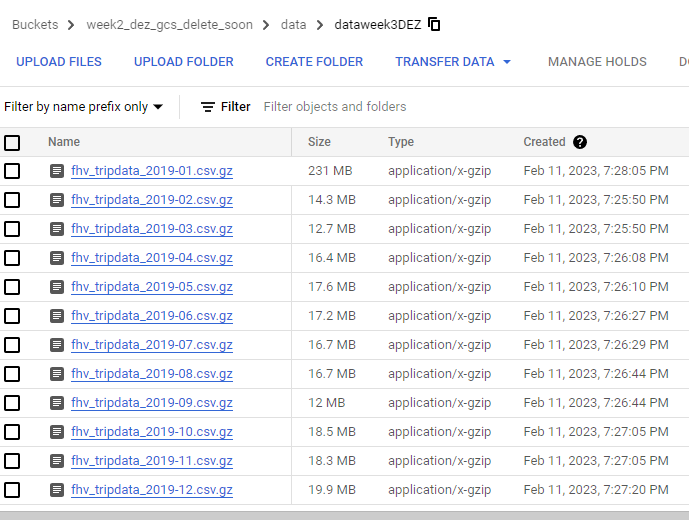
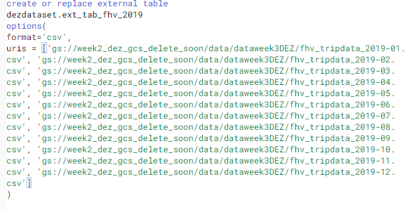
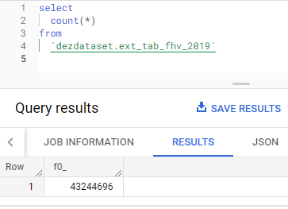
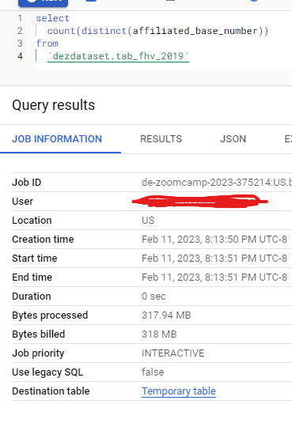
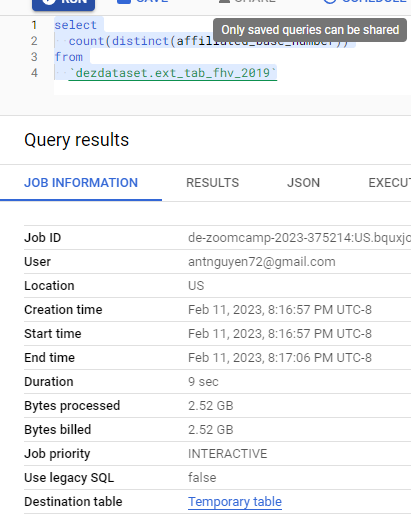
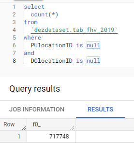
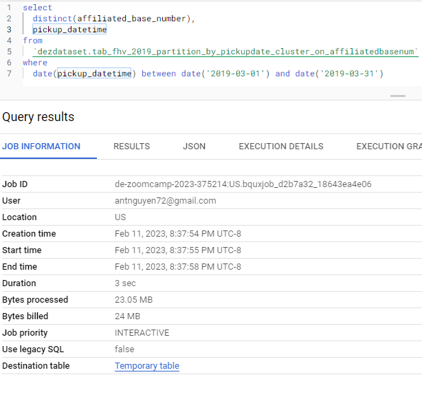
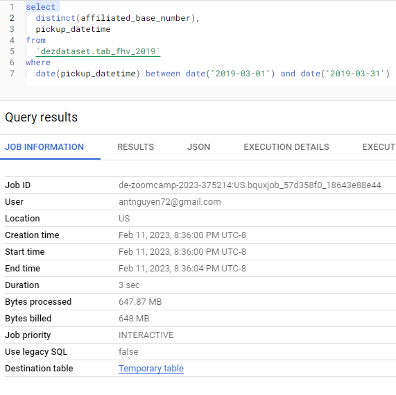

# Week 3 Homework

## Setup:

Data is downloaded from GitHub and uploaded to GCS

Create a table in BQ using the fhv-2019 data (do not partition or cluster this table)

Note: External table is created quickly --> This is because no I/O operation is being done. The table merely points toward the data path. But the data can be queried (It dawned on me...This is why it's called BigQuery)

## Question 1:
What is the count for fhv vehicle records for the year 2019?

## Question 2:
Write a query to count the distinct number of affiliated_base_number for the entire dataset on both tables.
What is the estimated amount of data that will be read when this query is executed on the External Table and the Table?

 

## Question 3:
How many records have both a blank(null) PUlocationID and DOlocationID in the entire dataset?

## Question 4:
What is the best strategy to make an optimized table in Big Query if your query will always filter by pickup_datetime and order by affiliated_base_number?

    Answer: Partition by pickup_datetime Cluster on affiliated_base_number
    All other options are not even possible due to data type difference

## Question 5:
Write a query to retrieve the distinct affiliated_base_number between pickup_datetime 
03/01/2019 and 03/31/2019 (inclusive)

Use the materialized table you created earlier in your from clause and note the estimated bytes. Now change the table in the from clause to the partitioned table you created for question 4 and note the estimated bytes processed. What are these values? 

Choose the answer which most closely matches

## Question 6:
Where is the data stored in an External table?

GCP Bucket (hence note earlier)

## Question 7:
Is it best practice in Big Query to always cluster your data?

No. If your dataset is less than 1Gb. It might not be wise to cluster or partition data. because the cost incurred from querying a non-clustered table is probably not more than the cost incurred from clustering operation

-
-
-
-
-
-
-
-
-
-
-
-
-
-
-
-
-
-
-
-
FILENAMES:

['gcs://week2_dez_gcs_delete_soon/data/dataweek3DEZ/fhv_tripdata_2019-01.csv', 'gcs://week2_dez_gcs_delete_soon/data/dataweek3DEZ/fhv_tripdata_2019-02.csv', 'gcs://week2_dez_gcs_delete_soon/data/dataweek3DEZ/fhv_tripdata_2019-03.csv', 'gcs://week2_dez_gcs_delete_soon/data/dataweek3DEZ/fhv_tripdata_2019-04.csv', 'gcs://week2_dez_gcs_delete_soon/data/dataweek3DEZ/fhv_tripdata_2019-05.csv', 'gcs://week2_dez_gcs_delete_soon/data/dataweek3DEZ/fhv_tripdata_2019-06.csv', 'gcs://week2_dez_gcs_delete_soon/data/dataweek3DEZ/fhv_tripdata_2019-07.csv', 'gcs://week2_dez_gcs_delete_soon/data/dataweek3DEZ/fhv_tripdata_2019-08.csv', 'gcs://week2_dez_gcs_delete_soon/data/dataweek3DEZ/fhv_tripdata_2019-09.csv', 'gcs://week2_dez_gcs_delete_soon/data/dataweek3DEZ/fhv_tripdata_2019-10.csv', 'gcs://week2_dez_gcs_delete_soon/data/dataweek3DEZ/fhv_tripdata_2019-11.csv', 'gcs://week2_dez_gcs_delete_soon/data/dataweek3DEZ/fhv_tripdata_2019-12.csv']
